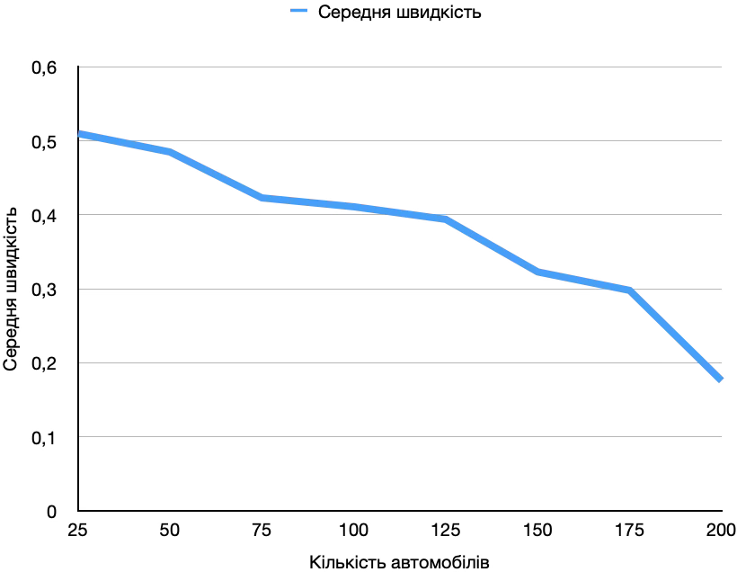
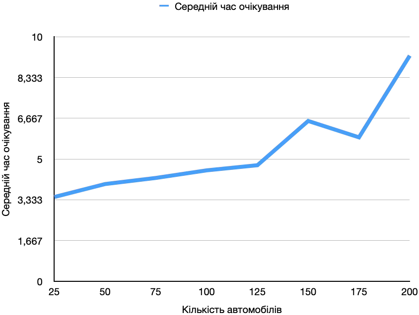
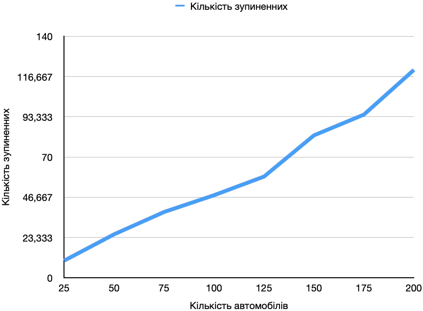

# Комп'ютерні системи імітаційного моделювання
## СПм-23-5, Ровенчак Владислав Миколайович
### Лабораторна робота №**1**. Опис імітаційних моделей та проведення обчислювальних експериментів

 

### Варіант 1, модель у середовищі NetLogo:
[Traffic Grid](https://www.netlogoweb.org/launch#http://www.netlogoweb.org/assets/modelslib/Sample%20Models/Social%20Science/Traffic%20Grid.nlogo)

 

### Вербальний опис моделі:
Моделюється рух автомобілів у грід-системі доріг і перехресть. Кожен автомобіль представлений агентом, який керується простим набором правил для регулювання своєї швидкості та напрямку. Вивчається взаємодія автомобілів на дорогах та перехрестях з метою аналізу впливу різних факторів на транспортний потік та час очікування. Автомобілі взаємодіють між собою та реагують на сигнали світлофорів на перехрестях.
### Керуючі параметри:
- **grid-size-x** визначає кількість вертикальних доріг.
- **grid-size-y** визначає кількість горизонтальних доріг.
- **num-cars** визначає автомобілів у симуляції.
- **power** визначає наявність світлофора.
- **ticks-per-cycle** визначає кількість тактів, які минуть для кожного цикл.
- **speed-limit** визначає максимальну швидкість для автомобілів.
- **current-auto** перемикає поточне світло між автоматичним режимом і ручним.
- **current-phase** визначає коли поточне світло змінюється, якщо воно в автоматичному режимі.

### Показники роботи системи:
- зупіненні автомобілі - відображає кількість зупинених автомобілів за час.
- середня швидкість автомобілів - відображає середню швидкість автомобілів за час.
- середний час очікування автомобілів - відображає середній час зупинки автомобілів за певний час.

### Примітки:
Кожного кроку автомобілі намагаються рухатися вперед із поточною швидкістю. Якщо їхня поточна швидкість менша за обмеження швидкості і прямо перед ними немає автомобіля, вони прискорюються. Якщо попереду є повільніша машина, вони зрівняються зі швидкістю повільнішої машини та сповільнюються. Якщо перед ними червоне світло або зупинилася машина, вони зупиняються.

### Недоліки моделі:
Модель не враховує ситуацій, пов’язаних зі злиттям рядів автомобілів, що може вплинути на реалістичність руху в умовах міста. Також вона не бере до уваги вплив погодних умов, дорожньої обстановки або інших чинників, які можуть впливати на рух транспорту в реальному місті. Поведінка автомобілів обмежена простим набором правил, і вони реагують лише на автомобілі, що знаходяться безпосередньо перед ними. Моделюється проста логіка “гальмуй або прискорюй”, що може не враховувати складніші аспекти руху в реальному місті.
 

## Обчислювальні експерименти
### 1. Вплив завантаженості дороги на кількість зупиненних автомобілів, середньої швидкісті автомобілів та середнього часу очікування автомобілів
Досліджується взаємозв’язок між кількістю зупинених автомобілів, середньою швидкістю автомобілів та середнім часом очікування протягом 200 тактів і числом автомобілів на трасі, яке визначається на початку симуляції. Експерименти проводяться з кількістю автомобілів від 25 до 200, з кроком 25, загалом 8 симуляцій.
Інші керуючі параметри мають значення за замовчуванням:
- **grid-size-x**: 5
- **grid-size-y**: 5
- **power**: On
- **ticks-per-cycle**: 20
- **speed-limit**: 1

<table>
<thead>
<tr><th>Кількість автомобілів</th><th>Кількість зупиненних</th><th>Середня швидкість</th><th>Середній час очікування</th></tr>
</thead>
<tbody>
<tr><td>25</td><td>9,94</td><td>0,51</td><td>3,45</td></tr>
<tr><td>50</td><td>25,23</td><td>0,485</td><td>3,98</td></tr>
<tr><td>75</td><td>38,16</td><td>0,423</td><td>4,23</td></tr>
<tr><td>100</td><td>47,89</td><td>0,411</td><td>4,54</td></tr>
<tr><td>125</td><td>58,7</td><td>0,394</td><td>4,75</td></tr>
<tr><td>150</td><td>82,6</td><td>0,323</td><td>6,56</td></tr>
<tr><td>175</td><td>94,65</td><td>0,298</td><td>5,89</td></tr>
<tr><td>200</td><td>120,56</td><td>0,176</td><td>9,23</td></tr>
</tbody>
</table>

Графік чітко демонструє, що значне збільшення кількості зупинених автомобілів, зниження середньої швидкості та збільшення середнього часу очікування відбувається при завантаженості більше ніж 125 автомобілів.
