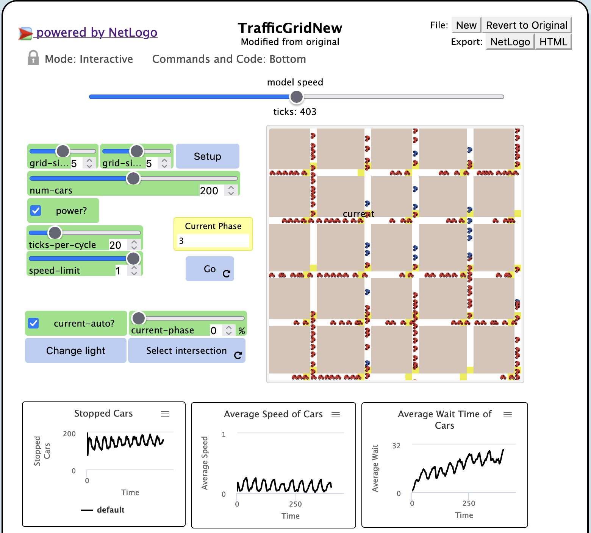
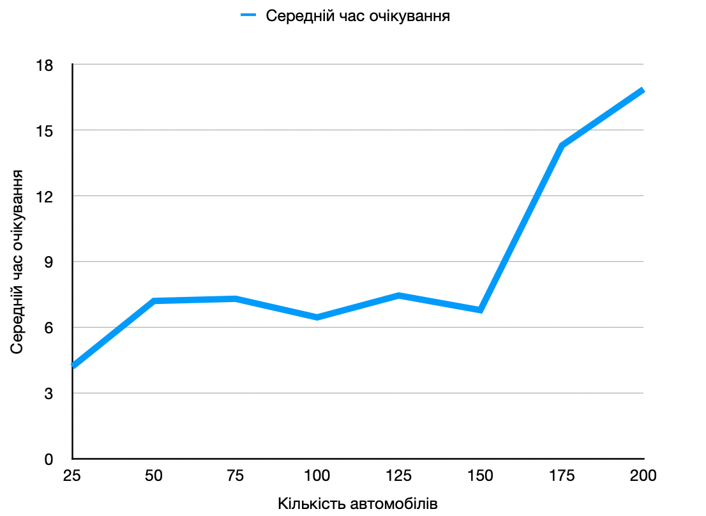
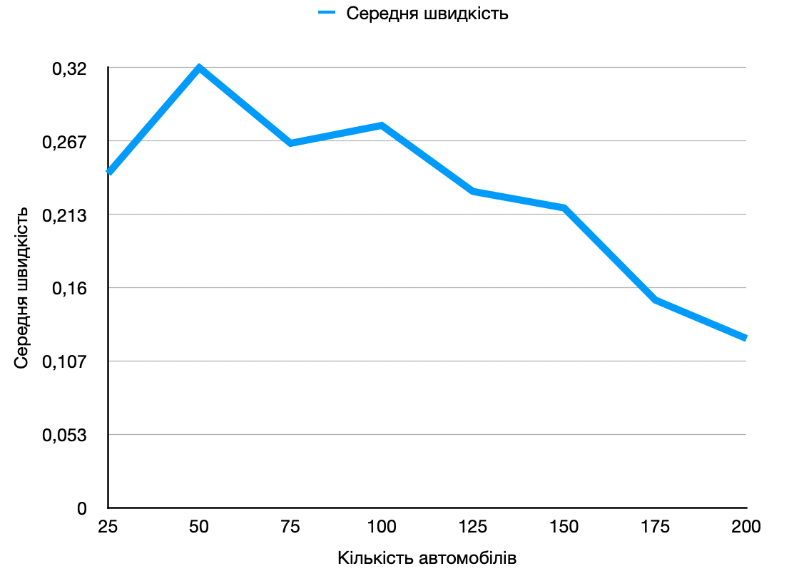
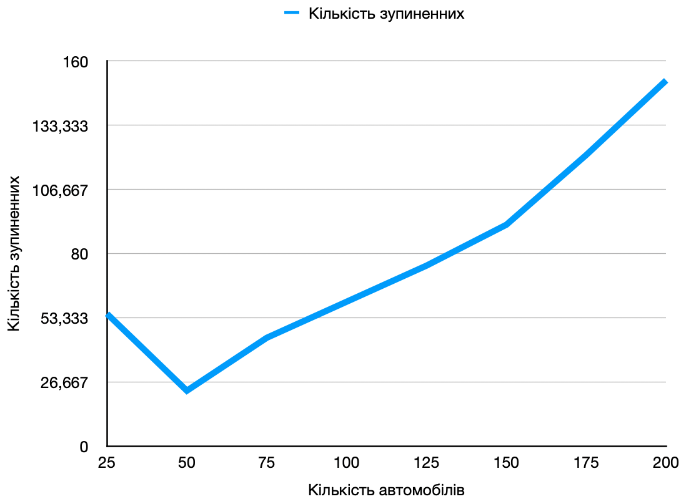

# Комп'ютерні системи імітаційного моделювання
## СПм-23-5, Ровенчак Владислав Миколайович
### Лабораторна робота №**2**. Редагування імітаційних моделей у середовищі NetLogo

 

### Варіант 1, модель у середовищі NetLogo:
[Traffic Grid](https://www.netlogoweb.org/launch#http://www.netlogoweb.org/assets/modelslib/Sample%20Models/Social%20Science/Traffic%20Grid.nlogo)

 

### Внесені зміни у вихідну логіку моделі, за варіантом:

**Додано жовтий сигнал світлофорів.**

Додано нову змінну для патча, яка відповідає за жовтий сигнал світлофора, аналогічно зеленому.
<pre>
  yellow-light? ;; true if the yellow light is on, false otherwise
</pre> 

Змінено процедуру setup-patches.

<pre>
to setup-patches
    ...
    ask patches
    [
      ...
      set yellow-light? false
      ...
    ]
    ...
end
</pre>

Процедура set-signal-colors була змінена. Тепер вона змінює колір світлофора в залежності від умов.

<pre>
to set-signal-colors  ;; intersection (patch) procedure
  ifelse power?
  [
    ifelse yellow-light?
    [
      ask patch-at -1 0 [ set pcolor yellow ]
      ask patch-at 0 1 [ set pcolor yellow ]
    ]
    [
      ifelse green-light-up?
      [
        ask patch-at -1 0 [ set pcolor red ]
        ask patch-at 0 1 [ set pcolor green ]
      ]
      [
        ask patch-at -1 0 [ set pcolor green ]
        ask patch-at 0 1 [ set pcolor red ]
      ]
    ]
  ]
  [
    ask patch-at -1 0 [ set pcolor white ]
    ask patch-at 0 1 [ set pcolor white ]
  ]
end
</pre>

Процедура set-signals була змінена. Тепер вона здатна перемикати жовтий сигнал світлофора.

<pre>
to set-signals
  ask intersections with [auto? and phase = floor ((my-phase * ticks-per-cycle) / 100)]
  [
    ifelse yellow-light?
    [
      set yellow-light? false
      set green-light-up? (not green-light-up?)
    ]
    [
      set yellow-light? true
    ]
    set-signal-colors
  ]
end
</pre>

Змінено процедуру to set-car-speed. Водії не їдуть на жовтий сигнал світлофора.

<pre>
to set-car-speed  ;; turtle procedure
  ifelse pcolor = red or pcolor = yellow
  ...
end
</pre>

**Додати вірогідність початку руху водіями не тільки на зелений, але і на жовтий сигнал світлофора.**

Додано глобальну змінну, яка визначає ймовірність початку руху водіями не лише на зелений, а й на жовтий сигнал світлофора. Її значення ініціалізовано на рівні 25%.
<pre>
  probability-movement-yellow
</pre>

Модифіковано процедуру set-car-speed. Автомобілі з ймовірністю 25% їдуть на жовтий колір світлофора:

<pre>
to set-car-speed  ;; turtle procedure
  ifelse pcolor = red or (pcolor = yellow and probability-movement-yellow < random-float 100)
  [ set speed 0 ]
  [
    ifelse up-car?
    [ set-speed 0 -1 ]
    [ set-speed 1 0 ]
  ]
end
</pre>

### Внесені зміни у вихідну логіку моделі, на власний розсуд:

**Встановлення ліміту максимальної швидкості для кожної машини здійснюється індивідуально**

Додано змінну машин

<pre>
turtles-own
  [
  car-speed-limit
  ...
  ]
</pre>

Швидкість машин коливається навколо обмеження швидкості в місті

<pre>
   set car-speed-limit (speed-limit - 0.2) + (random-float ((speed-limit + 0.2) - (speed-limit - 0.2)))
   if car-speed-limit < 0.1 [set car-speed-limit 0.1]
</pre>

Процедуру, в якій використовувалась змінна speed-limit, було модифіковано. Тепер замість неї враховується особиста швидкість кожного автомобіля. Також змінено колір машин під час їх руху. Раніше кольори змінювались, але це було важко помітити.
<pre>
to speed-up  ;; turtle procedure
  ifelse speed > car-speed-limit
  [ set speed car-speed-limit ]
  [ set speed speed + acceleration ]
end

;; set the color of the turtle to a different color based on how fast the turtle is moving
to set-car-color  ;; turtle procedure
  ifelse speed < (car-speed-limit / 2)
  [ set color blue ]
  [ set color red ]
end
</pre>

Фінальний код моделі та її інтерфейс доступні за
[посиланням](TrafficGridNew.nlogo)

 

## Обчислювальні експерименти
### 1. Вплив завантаженості дороги на кількість зупиненних автомобілів, середньої швидкісті автомобілів та середнього часу очікування автомобілів
Досліджується залежність між кількістю зупинених автомобілів, середньою швидкістю автомобілів та середнім часом їх очікування протягом певної кількості тактів (200) і числом машин на трасі, вказаним на початку симуляції. Експерименти проводяться з кількістю автомобілів від 25 до 200, з кроком 25, всього 8 симуляцій.
Інші керуючі параметри мають значення за замовчуванням:
- **grid-size-x**: 5
- **grid-size-y**: 5
- **power**: On
- **ticks-per-cycle**: 20
- **speed-limit**: 1

<table>
<thead>
<tr><th>Кількість автомобілів</th><th>Кількість зупинених</th><th>Середня швидкість</th><th>Середній час очікування</th></tr>
</thead>
<tbody>
<tr><td>25</td><td>55</td><td>0,243</td><td>4,2</td></tr>
<tr><td>50</td><td>23</td><td>0,32</td><td>7,2</td></tr>
<tr><td>75</td><td>45</td><td>0,265</td><td>7,3</td></tr>
<tr><td>100</td><td>60</td><td>0,278</td><td>6,45</td></tr>
<tr><td>125</td><td>75</td><td>0,23</td><td>7,45</td></tr>
<tr><td>150</td><td>92</td><td>0,218</td><td>6,78</td></tr>
<tr><td>175</td><td>121</td><td>0,151</td><td>14,3</td></tr>
<tr><td>200</td><td>152</td><td>0,123</td><td>16,87</td></tr>
</tbody>
</table>

Висновок: Графік чітко показує, що збільшення кількості автомобілів може призвести до підвищення загального трафіку, що впливає на рух усіх учасників, викликаючи затори, знижуючи середню швидкість і збільшуючи середній час очікування. Проте ці показники були гіршими в порівнянні з першою версією моделі, коли не було жовтого сигналу світлофора.
