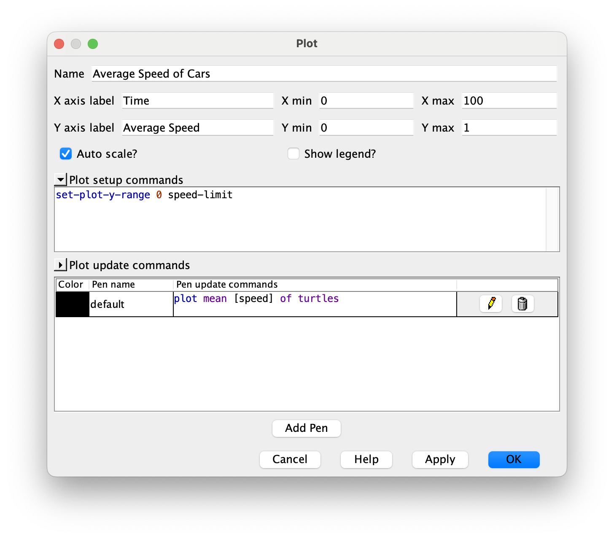
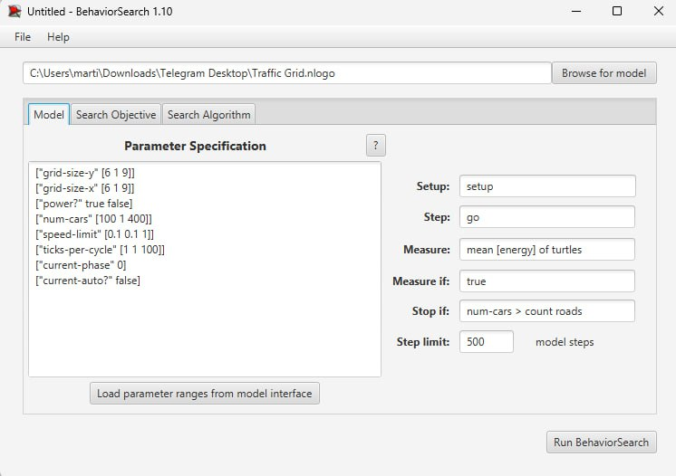
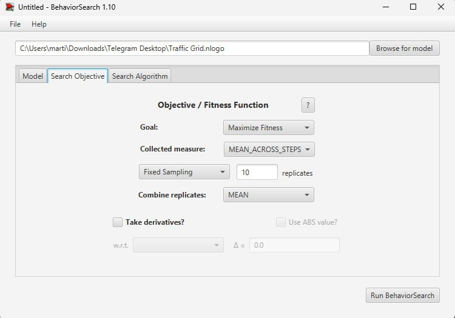
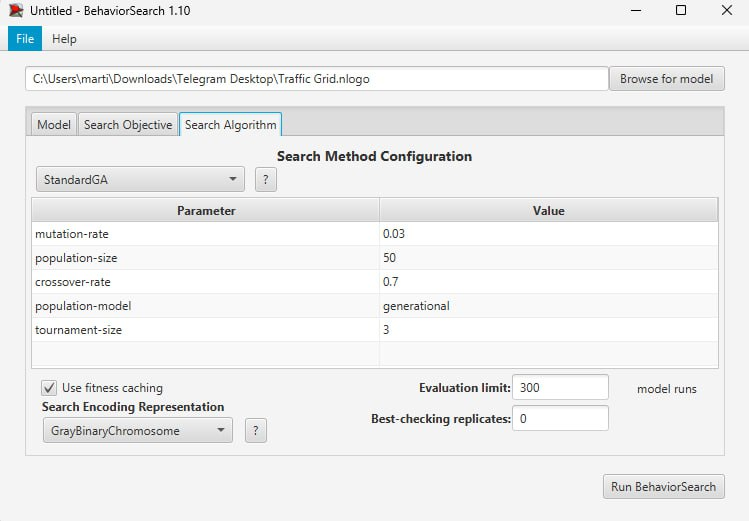
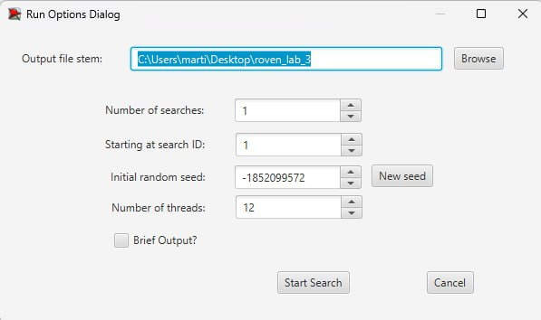
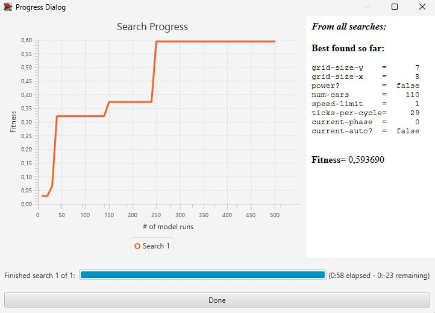
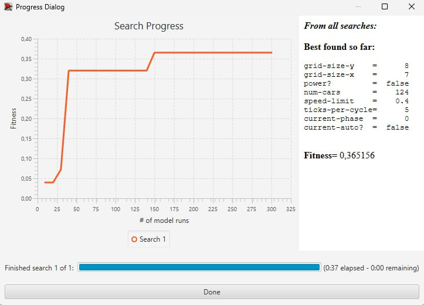

# Комп'ютерні системи імітаційного моделювання
## СПм-23-5, Ровенчак Владислав Миколайович
### Лабораторна робота №**3**. Використання засобів обчислювального інтелекту для оптимізації імітаційних моделей

 

### Варіант 1, модель у середовищі NetLogo:
[Traffic Grid](https://www.netlogoweb.org/launch#http://www.netlogoweb.org/assets/modelslib/Sample%20Models/Social%20Science/Traffic%20Grid.nlogo)

 

### Вербальний опис моделі:
Симуляція руху автомобілів у грід-системі доріг і перехресть. Кожен автомобіль у моделі представлений агентом, який керується простим набором правил, що визначають його швидкість і напрямок руху. Моделюється взаємодія автомобілів на дорогах та перехрестях з метою аналізу впливу різних факторів на транспортний потік і час очікування. Автомобілі взаємодіють між собою, а також реагують на сигнали світлофорів на перехрестях.
### Налаштування середовища BehaviorSearch:

**Обрана модель**:
<pre>
/Users/roven/Desktop/KCIM/lab3/Traffic Grid.nlogo
</pre>
**Параметри моделі** (вкладка Model):
<pre>
["grid-size-y" [6 1 9]]
["grid-size-x" [6 1 9]]
["power?" true false]
["num-cars" [100 1 400]]
["speed-limit" [0.1 0.1 1]]
["ticks-per-cycle" [1 1 100]]
["current-phase" 0]
["current-auto?" false]
</pre>
Використовувана **міра**:  :
Для фітнес-функції було обрано **середня швидкість автомобілів**. вираз для її розрахунку взято з налаштувань графіка аналізованої імітаційної моделі в середовищі NetLogo

та вказано у параметрі "**Measure**":
<pre>
mean [speed] of turtles
</pre>
Середня швидкість автомобілів враховується **в середньому** за весь період симуляції тривалістю, 500 тактів, починаючи з 0 такту симуляції.  
Параметр зупинки за умовою ("**Stop if**") виставлено в значення:
<pre>
  num-cars > count roads
</pre>
Загальний вигляд вкладки налаштувань параметрів моделі:

**Налаштування цільової функції** (вкладка Search Objective):  
Метою налаштування параметрів імітаційної моделі є **максимізація** середньої швидкості автомобілів. Це досягається за допомогою параметра “**Goal**”, який має значення **Maximize Fitness**. Тобто, необхідно знайти такі налаштування моделі, при яких середня швидкість автомобілів буде максимальною. Важливо зазначити, що йдеться не просто про середнє значення швидкості машин у конкретний момент часу, а про її середнє значення протягом усієї симуляції. Для цього в параметрі “**Collected measure**”, який визначає метод обліку показника, вказано **MEAN_ACROSS_STEPS**.
Щоб зменшити вплив випадкових факторів, що можуть виникати через випадкові значення в самій імітаційній моделі, **кожна симуляція виконується 10 разів**, і результати обчислюються як **середнє арифметичне**.
Загальний вигляд вкладки налаштувань цільової функції:

**Налаштування алгоритму пошуку** (вкладка Search Algorithm):  
Загальний вигляд вкладки налаштувань алгоритму пошуку:

 

### Результати використання BehaviorSearch:
Діалогове вікно запуску пошуку

Результати налаштування параметрів імітаційної моделі за допомогою **генетичного алгоритму**:

Результати налаштування параметрів імітаційної моделі за допомогою **випадкового пошуку**:

 
